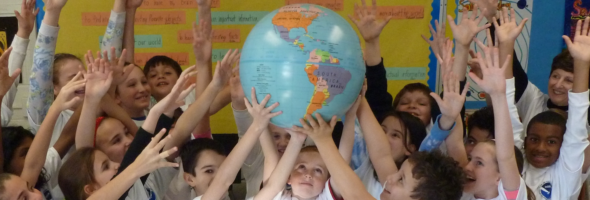

# Climate change: Teachers' perceptions and self-efficacy regarding its teaching in Primary School

## tools: Python
This research was carried out with the aim of studying the perceptions of primary school teachers in the region of Epirus on climate change. In addition, the level of self-efficacy of teachers in terms of teaching climate change was studied, as well as the relationship between the two above.
Thus, this research was designed in order to provide answers to the following research questions:
* What are the teachers' basic perceptions of climate change?
* To what extent do teachers consider it necessary to educate students about climate change?
* What do teachers see as the main challenges in teaching climate change?
* What is the level of self-efficacy of teachers in teaching climate change in school?
* Is there a correlation between teachers' core beliefs and self-efficacy for teaching climate change?
* To what extent can demographic factors such as age, years of service, general education and training in environmental issues influence the above perceptions and beliefs of teachers?
